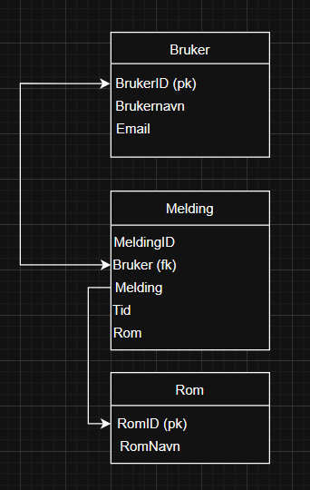

# Dokumentasjon 

Her er datamodellen.




## Rom
Jeg har lagt til muligheten for å lage rom som kun viser meldinger som ble send i det rommet. 

```js
        async function hentRom() {
            const response = await fetch('/alleRom'); 
            const rom = await response.json();
             romDiv.innerHTML = '';
            for (let Rom of rom) {
                const btn = document.createElement('button');
                btn.textContent = Rom.Navn;

                btn.onclick = () => {
                    window.location.href = `/${Rom.romid}`; //tar deg til chat siden med ID'en til rommet du valgte
                };

                romDiv.appendChild(btn);
            }
        }
```

## Video om Bcrypt og sessions


<video width="640" height="360" controls>
  <source src="C:\ChatApp\ChatApp\KodeForklaring.mp4" type="video/mp4">
  Your browser does not support the video tag.
</video>
